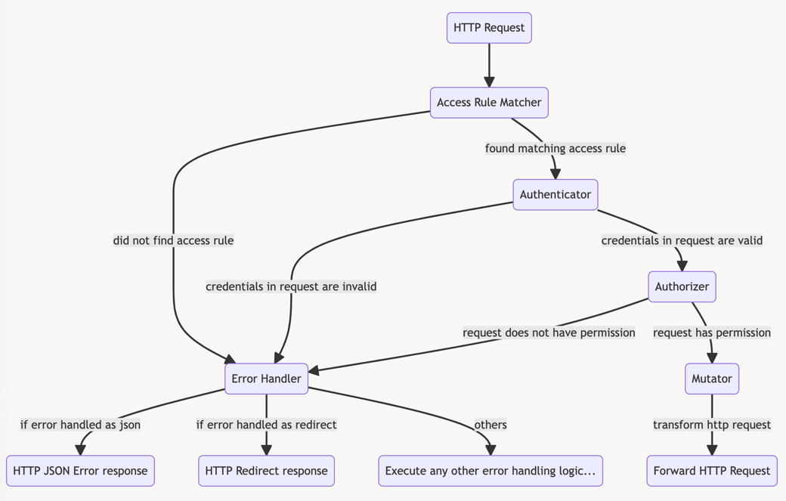

# Authentication and Authorization

The intended target state for Workday is to extract all forms of Authentication and Authorization from the spring boot
and or react application, but rather make use of an identity aware proxy (Ory's Oathkeeper) to make such decisions.

This means that all incoming requests to the Spring Boot application are expected to be authenticated, and authorised,
such that the application can focus on the functional logic solely.

## Roadmap

(🟡 being worked on, 🟢 done )

1. 🟡 Setup authentication model in `flock-iam` project (external to Workday)
2. 🟡 Introduce Oathkeeper proxy for Workday, to route all traffic through it before reaching the app itself
3. 🟡 Authentication via Ory's Kratos
4. 'Simpler' `GET` and `PUT` endpoints authorization
5. `POST` / create endpoint
6. List endpoints
7. Removal of authorities from workday app itself

## Understanding the Ory stack

(probably best to move me to flock-iam related repo?)

There are multiple components to the Ory stack

- Kratos, ...
- Oathkeeper, ...
- Keto, ...

Every http request to the Workday app is called via the Oathkeeper proxy (running on port `8081`)



Oathkeeper performs various checks:

1. Is there a matching access rule? If no, handle error
2. Is the user's request authenticated through a `cookie_sesion`? If no, handle error
3. Is the user's request authorized? If no, handle error
4. Mutate the request (e.g. to amend user information to the request)

## Workday's permission model

[Ory's keto](https://www.ory.sh/docs/keto/) make use of a permission model, to determine whether a given subject (a
User) can access an object (e.g. a Workday, a Holiday, etc.). A permission model consists of two parts: a relation
model, and the derived permissions from said these relations.

Below you'll find the initial _relations model_ for Workday.


Which can be read as

- A _Person_ is the **owner** of a _Workday_
- A _User_ is the **owner** of a _Person_
- A _Flock_ is the **organisational unit** of a _Person_
- A _Flock_ is the **organisational unit** of a _Flock_
- A _User_ is the **manager** of a _Flock_
- etc.

> ℹ️
> This model allows manager of (a) Flock. to have a relation with a specific Workday coupled to a person.
>
> E.g. _Workday-X_ is **owned** by _Person-Y_, which is part of **organisational unit** _Flock-Z_, which in turn is \* > \*managed\*\* by _User-manager-A_

Besides the relations model, Workday also need permissions assigned. Ory's keto, provided an intuitive concept for
permissions in the following form:

> _subject_ can **permission** _object_? yes/no

These are derived from the relations, and are essentially a graph traversal.

In the permission model the following rules apply (amongst others):

- An owner of a Person can view and edit all owned Workdays by that Person.
- A manager of a Person can view and edit all owned Workdays by that Person.
- A manager of a Flock is the manager of all Persons that have said Flock as their organizational unit.
- A manager of a Flock is the manager of all Flocks that have said Flock as their organizational unit.

for the implementation details see [permissions.ts](../docker/keto/namespaces/permissions.ts)

## Developing Workday with Ory

> ℹ️ Prerequisites:
>
> 1. In your `etc/hosts`, the domains `accounts.flock.local`, `fe-workday.flock.local` and `workday.flock.local` should both resolve to 127.0.0.1
>
> ```
>   127.0.0.1	accounts.flock.local
>   127.0.0.1	workday.flock.local
>   127.0.0.1	fe-workday.flock.local
> ```
>
> 2. Run `docker compose up -d` to start all Ory related containers for identity and access management.
> 3. Also, make sure that you're The workday application tries to connect to is expected to run on port `8080`, with

     profile [`🔗develop`](src/main/resources/application-develop.properties)
     and [`🔗develop-kratos`](src/main/resources/application-develop-kratos.properties) active (in that order!)

By default, the `kratos-setup-users` container will try to create identities (= users) found in
the [docker/kratos/identities](../docker/kratos/identities) folder. Workday can use the resulting kratosIds to bind them
to the mocked users created on startup.

> ⚠️ `kratosId`s
>
> Note that the `kratosId`s defined in [🔗`Users.kt`](src/develop/kotlin/community/flock/eco/workday/mocks/Users.kt) will
> have different ids from the generated ones. These are substituted with the actual Kratos identities when Workday
> creates
> the users.

### Generate a jwks.json

(flock-iam material)
To generate a `jwks.json` file:

```bash
docker run oryd/oathkeeper:v0.40.3 credentials generate --alg RS256 > jwks.json
```
